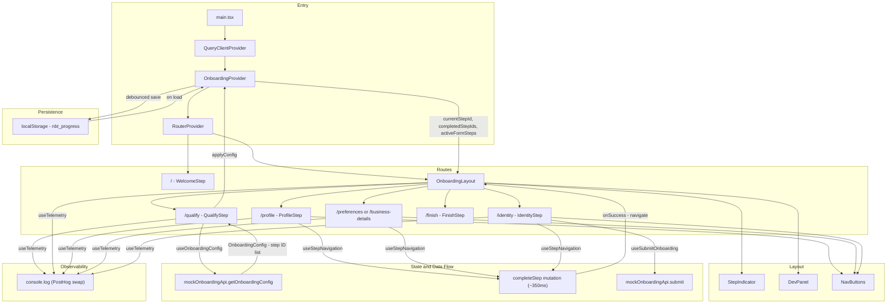

# NBT — The Next Big Thing

A multi-step onboarding wizard built as a frontend take-home project. Demonstrates form validation, async interactions, state persistence, animations, and an architecture designed for easy backend integration.

**Live demo:** [https://nbt-demo.netlify.app](https://nbt-demo.netlify.app)

---

## Getting Started

```bash
npm install
npm run dev
```

Open [http://localhost:5173](http://localhost:5173).

```bash
npm test          # run all tests once
npm run test:watch  # watch mode
```

---

## Tech Stack

| Package | Why |
|---|---|
| **React 19 + TypeScript** | UI framework with full type safety |
| **Vite** | Fast dev server and build tooling |
| **React Router v7** | Each wizard step is a discrete route (`/profile`, `/identity`, etc.) |
| **Tailwind CSS v4** | Utility-first styling with CSS custom properties for theming |
| **React Hook Form + Zod** | Performant form state with schema-driven validation |
| **TanStack Query (React Query)** | Data fetching layer — queries and mutations are ready to point at real endpoints |
| **Framer Motion** | Page transitions, step animations, and micro-interactions |
| **Vitest** | Unit tests for validation schemas and hooks, co-located with source files |

---

## Project Structure

```
src/
├── onboarding/
│   ├── api/               # mockOnboardingApi — mirrors real endpoint shapes
│   ├── assets/            # Avatars and onboarding-specific assets
│   ├── components/
│   │   ├── layout/        # OnboardingLayout, StepIndicator, NavButtons
│   │   └── steps/         # One component per wizard step
│   │       ├── WelcomeStep.tsx          # Landing page (/)
│   │       ├── QualifyStep.tsx          # Account type selection (/qualify)
│   │       ├── ProfileStep.tsx          # /profile
│   │       ├── PreferencesStep.tsx      # /preferences  (personal flow)
│   │       ├── BusinessDetailsStep.tsx  # /business-details  (business flow)
│   │       ├── IdentityStep.tsx         # /identity
│   │       └── FinishStep.tsx           # /finish
│   ├── config/
│   │   └── steps.ts       # Client step registry: all possible steps with paths + components
│   ├── context/
│   │   └── OnboardingContext.tsx  # Global wizard state, completeStep mutation, applyConfig
│   ├── hooks/
│   │   ├── useStepNavigation.ts  # advance() — wraps completeStep + navigate per step
│   │   └── useTelemetry.ts       # Typed event tracking (console mock, PostHog-ready)
│   ├── queries/           # React Query hooks — real fetch calls commented in, mocks active
│   │   ├── useOnboardingConfig.ts    # POST qualifier answers → receive step list
│   │   ├── useOnboardingProgress.ts  # GET saved progress
│   │   ├── useSaveOnboardingProgress.ts
│   │   ├── useCheckScreenName.ts
│   │   └── useSubmitOnboarding.ts
│   ├── schemas/           # Zod schemas per step (*.test.ts co-located)
│   └── types/             # Shared TypeScript interfaces
│
├── shared/
│   ├── components/
│   │   ├── ui/            # Button, Input, Toaster, ErrorView, AvatarImage, StarField
│   │   └── dev/           # DevPanel — reset, skip, error trigger (dev only)
│   ├── hooks/             # useDebounce (*.test.ts co-located)
│   ├── lib/               # promiseDelay
│   └── services/          # localStorageService
│
docs/
├── schema.sql              # Proposed database schema
└── create-account-flow.md  # Backend transaction flow for account creation
```

---

## Connecting a Real Backend

All API calls are isolated to `src/onboarding/queries/`. Each query function has the real `fetch` call commented out directly above the mock:

```ts
queryFn: async () => {
  // TODO: replace mock with real endpoint when API is available
  // const res = await fetch('/api/v1/onboarding/progress')
  // if (!res.ok) return null
  // return res.json()
  return mockOnboardingApi.loadProgress()
}
```

To integrate: uncomment the fetch block, delete the mock call, remove `mockOnboardingApi` imports. No changes needed in components or context.

See [`docs/schema.sql`](./docs/schema.sql) for the proposed database schema and [`docs/create-account-flow.md`](./docs/create-account-flow.md) for the full account creation transaction flow.

---

## Component Architecture



---

## Refactors

### v2 — Server-driven flow + simplified orchestration

**What:** The original wizard used a static, client-defined step order. v2 makes the flow server-driven and strips client-side orchestration down to a thin rendering layer.

**Key changes:**

**Server-driven step config** — A new `/qualify` screen asks the user their account type and POSTs to `getOnboardingConfig`. The server returns an ordered list of step IDs (`OnboardingConfig`). The client resolves those IDs against its local step registry and activates only the matched steps. Business accounts get `[profile, business-details, identity]`; personal accounts get `[profile, preferences, identity]`. The client never decides which steps to show.

**ID-based state** — `currentStep: number` and `completedSteps: number[]` were replaced with `currentStepId: string` and `completedStepIds: string[]`. Numeric indexes are brittle the moment the server can return a variable-length list; IDs are stable regardless of position. The route guard, stepper, and nav buttons all derived their logic from the index — all of that was rewritten around IDs.

**`completeStep` mutation** — Every step advance now calls a server mutation (`mockOnboardingApi.completeStep`). In a real app this is a `POST /steps/:id/complete`. The mutation is owned by `OnboardingContext` and exposes `isCompletingStep` — NavButtons picks this up automatically for its loading state. No step component manages its own navigation state.

**`useStepNavigation` hook** — Navigation boilerplate (`getActiveStepIndex`, `getActiveNextPath`, `markStepComplete`, `setCurrentStep`) was replaced by a single hook. Step components call `advance()` in their submit handler; the hook handles timing, the mutation, telemetry, and the navigate call.

**Journey persistence** — `activeStepIds` is written to localStorage alongside form data. On refresh, the context restores the active step list so a 3-step personal journey doesn't expand back to 4 steps.

**Simplified route guard** — The old guard used index math and a `useRef` workaround to prevent redirect races during reset. The new guard uses `stepIdx === -1` as an early return for any non-form route (`/qualify`, `/finish`, `/`), making the race impossible and removing the need for refs or suppressed lint rules.

**Observability** — `useTelemetry` wraps all event tracking behind a typed discriminated union. The mock logs to console; swapping to PostHog is one uncommented line.
