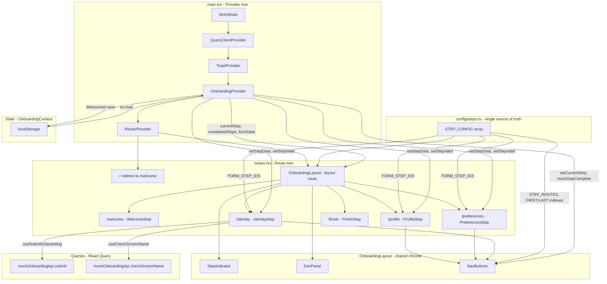

# NBT — The Next Big Thing

A multi-step onboarding wizard built as a frontend take-home project. Demonstrates form validation, async interactions, state persistence, animations, and an architecture designed for easy backend integration.

**Live demo:** [https://nbt-demo.netlify.app](https://nbt-demo.netlify.app)

---

## Getting Started

```bash
npm install
npm run dev
```

Open [http://localhost:5173](http://localhost:5173).

```bash
npm test          # run all tests once
npm run test:watch  # watch mode
```

---

## Tech Stack

| Package | Why |
|---|---|
| **React 19 + TypeScript** | UI framework with full type safety |
| **Vite** | Fast dev server and build tooling |
| **React Router v7** | Each wizard step is a discrete route (`/profile`, `/identity`, etc.) |
| **Tailwind CSS v4** | Utility-first styling with CSS custom properties for theming |
| **React Hook Form + Zod** | Performant form state with schema-driven validation |
| **TanStack Query (React Query)** | Data fetching layer — queries and mutations are ready to point at real endpoints |
| **Framer Motion** | Page transitions, step animations, and micro-interactions |
| **Vitest** | Unit tests for validation schemas and hooks, co-located with source files |

---

## Project Structure

```
src/
├── main.tsx               # Provider tree: QueryClient → Toast → OnboardingProvider → Router
├── onboarding/
│   ├── routes.tsx         # / redirects to /welcome; all steps rendered under OnboardingLayout
│   ├── api/               # mockOnboardingApi — mirrors real endpoint shapes
│   ├── assets/            # Avatars and onboarding-specific assets
│   ├── components/
│   │   ├── layout/
│   │   │   ├── OnboardingLayout.tsx  # Route guard, stepper chrome, page transitions
│   │   │   ├── StepIndicator.tsx     # Progress dots driven by currentStep / completedSteps
│   │   │   └── NavButtons.tsx        # Back/Next — reads step positions from config/steps
│   │   └── steps/
│   │       ├── WelcomeStep.tsx   # /welcome
│   │       ├── ProfileStep.tsx   # /profile
│   │       ├── PreferencesStep.tsx  # /preferences
│   │       ├── IdentityStep.tsx  # /identity — also calls useSubmitOnboarding
│   │       └── FinishStep.tsx    # /finish
│   ├── config/
│   │   └── steps.ts       # Single source of truth: step order, paths, components, IDs
│   │                      # Adding a step here registers it in routes, stepper, and nav
│   ├── context/
│   │   └── OnboardingContext.tsx  # currentStep, completedSteps, formData, persistence
│   ├── queries/           # React Query hooks — real fetch commented in, mock active
│   │   ├── useOnboardingProgress.ts
│   │   ├── useSaveOnboardingProgress.ts
│   │   ├── useCheckScreenName.ts
│   │   └── useSubmitOnboarding.ts
│   ├── schemas/           # Zod schemas per step (*.test.ts co-located)
│   └── types/             # OnboardingFormData, OnboardingProgress, etc.
│
├── shared/
│   ├── components/
│   │   ├── ui/            # Button, Input, Toaster, ErrorView, AvatarImage, StarField
│   │   └── dev/           # DevPanel — reset, skip, error trigger (dev only)
│   ├── hooks/             # useDebounce (*.test.ts co-located)
│   ├── lib/               # promiseDelay
│   └── services/          # localStorageService
│
docs/
├── schema.sql              # Proposed database schema
└── create-account-flow.md  # Backend transaction flow for account creation
```

---

## Component Architecture



---

## Connecting a Real Backend

All API calls are isolated to `src/onboarding/queries/`. Each query function has the real `fetch` call commented out directly above the mock:

```ts
queryFn: async () => {
  // TODO: replace mock with real endpoint when API is available
  // const res = await fetch('/api/v1/onboarding/progress')
  // if (!res.ok) return null
  // return res.json()
  return mockOnboardingApi.loadProgress()
}
```

To integrate: uncomment the fetch block, delete the mock call, remove `mockOnboardingApi` imports. No changes needed in components or context.

See [`docs/schema.sql`](./docs/schema.sql) for the proposed database schema and [`docs/create-account-flow.md`](./docs/create-account-flow.md) for the full account creation transaction flow.
